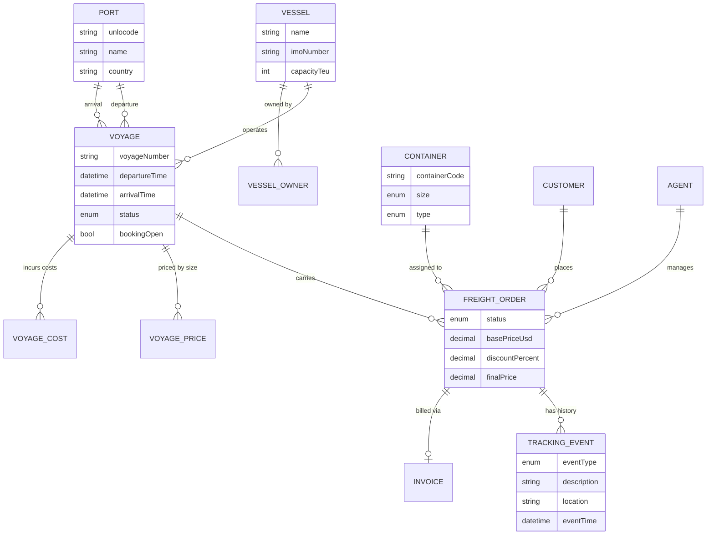
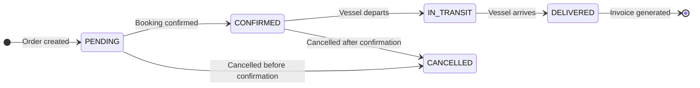
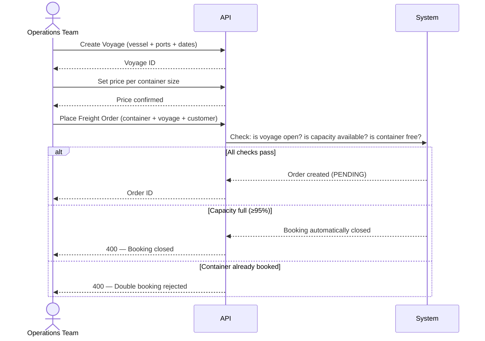
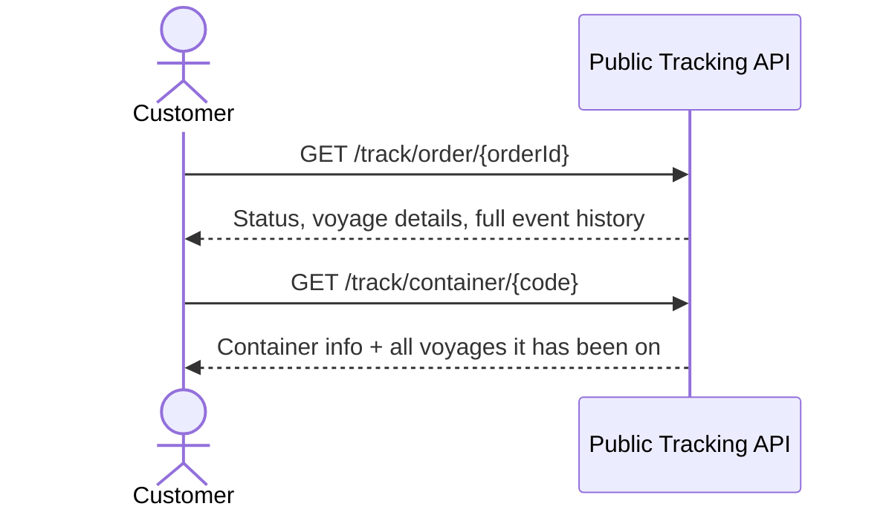
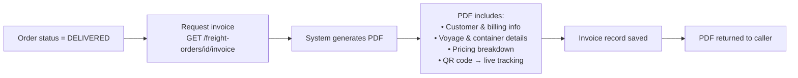
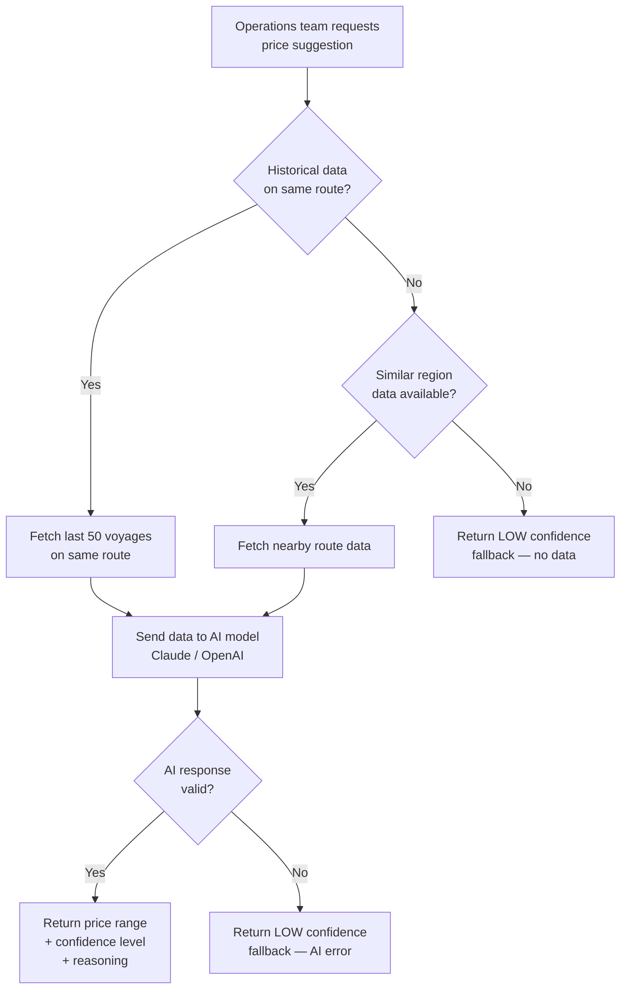
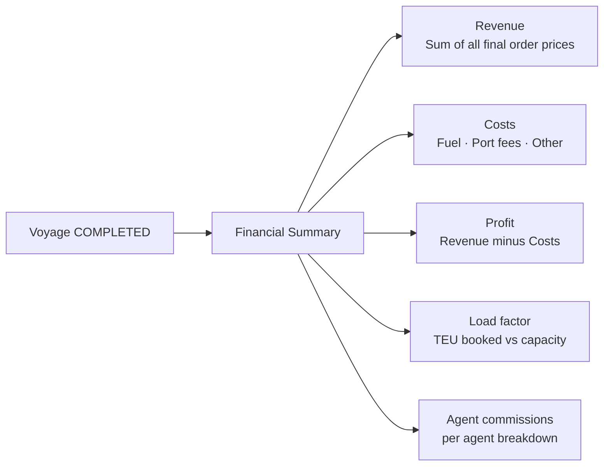
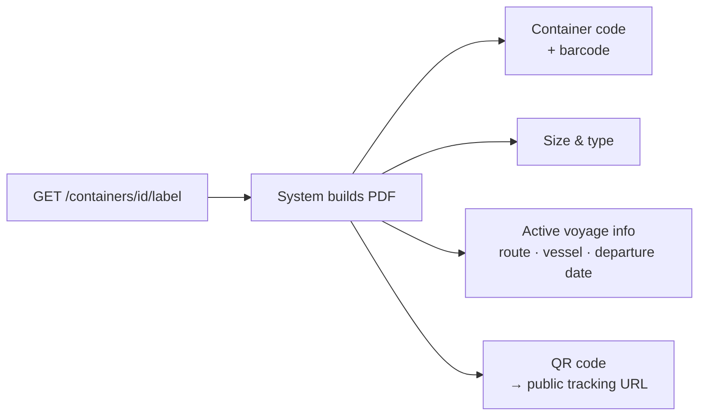

# Freight Operations Platform — System Overview

**Purpose:** Internal platform for managing container shipping operations — from scheduling voyages
to booking freight, tracking shipments, and generating invoices.

---

## 1. Core Concepts

| Concept           | What it is                                                                                |
|-------------------|-------------------------------------------------------------------------------------------|
| **Port**          | A physical port location identified by a 5-character code (e.g. AEJEA = Jebel Ali, Dubai) |
| **Vessel**        | A cargo ship with a fixed TEU capacity (e.g. 3,000 TEU)                                   |
| **Container**     | A physical shipping container — 20ft (1 TEU) or 40ft (2 TEU), various cargo types         |
| **Voyage**        | A scheduled trip of one vessel between two ports on specific dates                        |
| **Freight Order** | A booking: one container on one voyage, for one customer, priced and tracked              |
| **Invoice**       | A PDF billing document generated once an order reaches DELIVERED status                   |
| **Agent**         | An internal or external sales representative who places orders and earns commission       |
| **Customer**      | The shipping client whose cargo is being transported                                      |
| **Operator**      | An internal system user who creates freight orders (replaces free-text `orderedBy`)       |

---

## 2. Data Model

---

## 3. Freight Order Lifecycle

A freight order moves through five states from creation to billing.

---

## 4. Main Business Flows

### 4.1 Booking a Shipment

### 4.2 Shipment Tracking (Public)

### 4.3 Invoice Generation

### 4.4 AI-Assisted Pricing

---

## 5. Voyage Financial Summary

Available once a voyage is **COMPLETED**. Aggregates all financial data in one view.

---

## 6. Container Label

Every container can produce a printable PDF label on demand.

---

## 7. API Surface Summary

| Domain          | Endpoints     | Key Actions                                            |
|-----------------|---------------|--------------------------------------------------------|
| Ports           | 3             | Create, get, list                                      |
| Vessels         | 3 + ownership | Create, list, manage fractional ownership              |
| Voyages         | 10            | Full lifecycle management, pricing, costing, analytics |
| Freight Orders  | 7             | Book, price, track, invoice                            |
| Customers       | 3             | Create, list, get                                      |
| Agents          | 4             | Create, list, update commission & status               |
| Public Tracking | 2             | Track by order ID or container code — no auth required |
| AI Pricing      | 1             | Price range suggestion with confidence level           |
| Container Label | 1             | On-demand PDF label with QR code                       |

---

## 8. Key Business Rules

- **No double booking** — a container can only appear on one open voyage at a time.
- **Automatic cutoff** — when a voyage reaches 95% TEU capacity, bookings close automatically.
- **Invoice gate** — invoices can only be generated for orders in DELIVERED status.
- **Discount tracking** — every discount requires a stated reason and is preserved on the invoice.
- **Agent commission** — commission percentage is recorded per order for financial reporting.
- **One cargo mode per voyage** — a voyage carries either container cargo (TEU) or bulk cargo
  (tonnes), never both.

---

## 9. Planned: Bulk Cargo Support

The platform currently handles containerised cargo only. A planned extension (`CRG-001`) will add
support for **bulk cargo** — grain, coal, iron ore, crude oil — which is transported differently:

| Dimension       | Container Cargo     | Bulk Cargo (planned)             |
|-----------------|---------------------|----------------------------------|
| Unit            | TEU (20 ft / 40 ft) | Metric tonnes or cubic metres    |
| Vessel capacity | TEU capacity        | Deadweight tonnage (DWT)         |
| Booking unit    | One container       | Quantity in tonnes per commodity |
| Price basis     | Per container size  | Per tonne per commodity type     |

When implemented, freight orders will carry a `cargoMode` flag (`CONTAINER` or `BULK`). Bulk
voyages will validate total booked tonnes against the vessel's DWT, and a new
`/voyages/{id}/bulk-load` endpoint will provide DWT utilisation visibility — the equivalent of the
existing TEU load endpoint.
